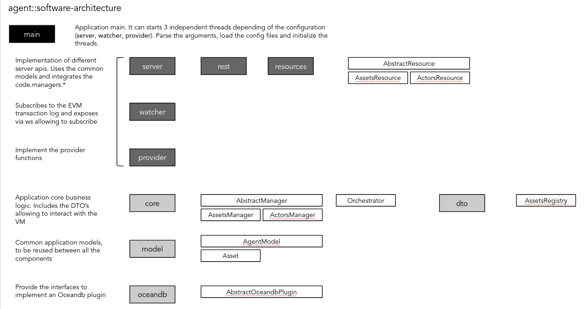

=====
Agent
=====

.. image:: https://img.shields.io/pypi/v/agent.svg
        :target: https://pypi.python.org/pypi/ocean-agent

.. image:: https://img.shields.io/travis/aaitor/agent.svg
        :target: https://travis-ci.org/aaitor/ocean-agent

.. image:: https://readthedocs.org/projects/agent/badge/?version=latest
        :target: https://ocean-agent.readthedocs.io/en/latest/?badge=latest
        :alt: Documentation Status

.. image:: https://pyup.io/repos/github/aaitor/ocean-agent/shield.svg
     :target: https://pyup.io/repos/github/aaitor/ocean-agent/
     :alt: Updates

Template Ocean Agent

* Free software: Apache Software License 2.0
* Documentation: https://ocean-agent.readthedocs.io.

Features
--------

* Ocean Agent application template
* pytest
* packages organizing the application
  - server: Implementation of different server apis. Uses the common models and integrates the code.managers.*
  - watcher: Subscribes to the EVM transaction log and exposes via ws allowing to subscribe
  - provider: Implement the provider functions
  - core: Application core business logic. Includes the DTO’s allowing to interact with the VM
  - model: Common application models, to be reused between all the components
  - oceandb: Provide the interfaces to implement an Oceandb plugin

Credits
-------

This package was created with Cookiecutter_ and the `audreyr/cookiecutter-pypackage`_ project template.

.. _Cookiecutter: https://github.com/audreyr/cookiecutter
.. _`audreyr/cookiecutter-pypackage`: https://github.com/audreyr/cookiecutter-pypackage
